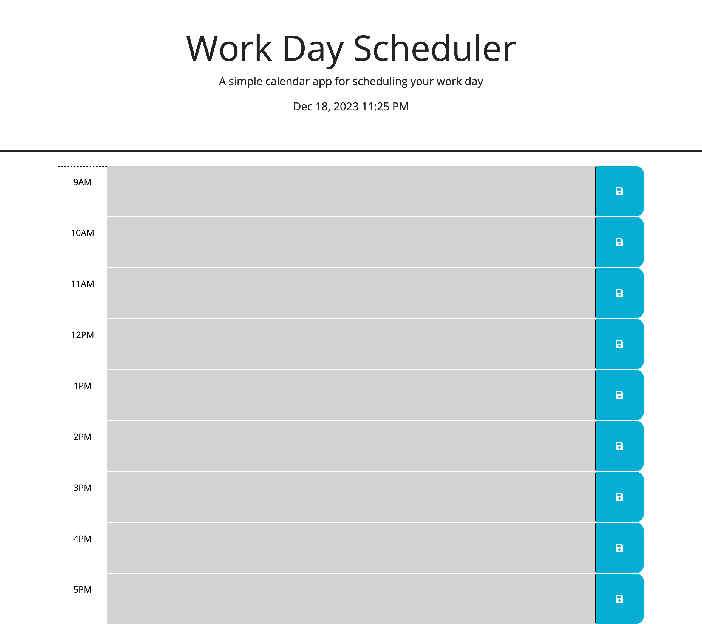

# daily-calendar
Week 5 Challenge

In this challenge, I was given the task of editing a starter code so that when the application is run, it features a working daily planner to which users can save events to specific time blocks in a typical 9-5 working day. This application contains the following features:

- current date and time

- time blocks for every hour betwen 9am to 5pm

- text areas in each time block for users to enter up to 3 events

- save buttons for each time block which save entered events to the planner

- color coded time blocks based off the current time
    * gray = past
    * red = present
    * green = future

Live application: https://yaserhdev.github.io/daily-calendar/

* Source code: yaser/bootcamp/daily-calendar